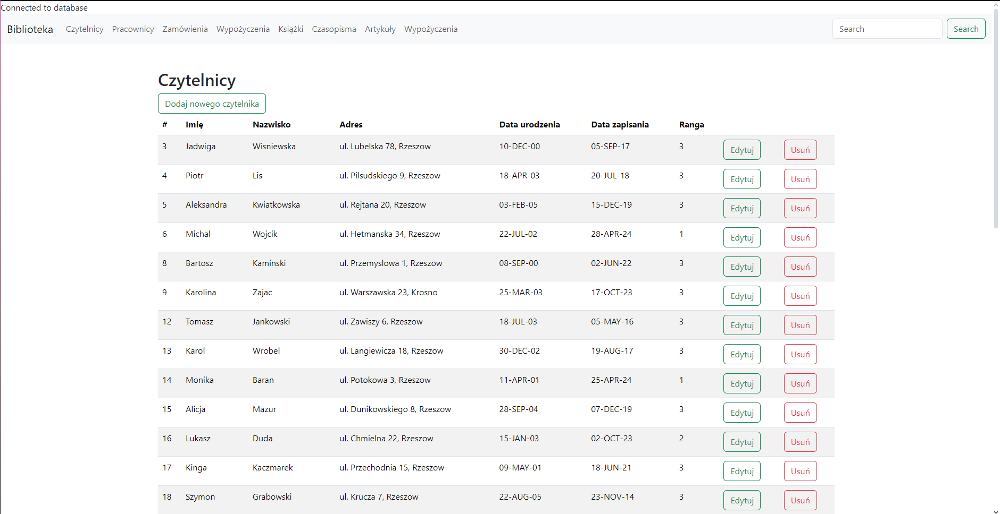
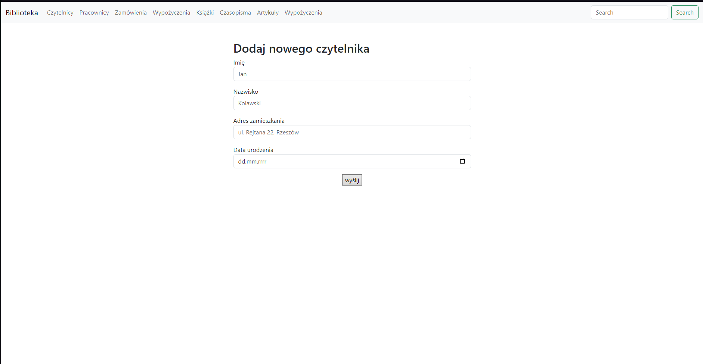
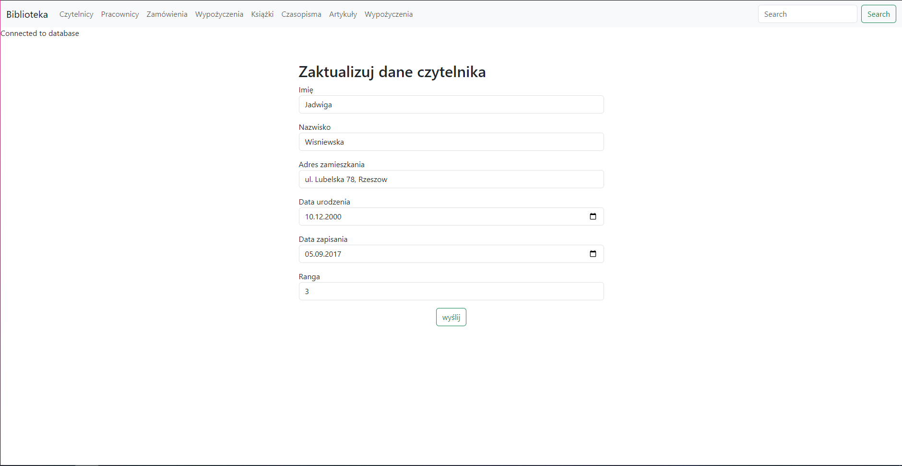

# System Zarządzania Biblioteką 

Kompleksowy system webowy służący do zarządzania strukturą biblioteczną (czytelnie, książki, czasopisma, pracownicy) oraz operacjami związanymi z rezerwacją, wypożyczaniem i naliczaniem opłat (kar). Projekt łączy w sobie relacyjną bazę danych oraz rozbudowany interfejs użytkownika.

## Technologie i Narzędzia

* **SQL (Oracle PL/SQL)** – zaawansowana relacyjna baza danych, w której zaszyto całą logikę biznesową systemu.
* **PHP** – warstwa prezentacji po stronie klienta, realizująca bezpieczne połączenia i wywołania procedur Oracle za pomocą natywnego rozszerzenia **OCI8**.
* **Bootstrap 5** – framework CSS zapewniający nowoczesny, responsywny i przejrzysty wygląd interfejsu (tabele danych, nawigacja).

---

## Programowanie Bazodanowe i Architektura (PL/SQL)

Logika systemu została zaimplementowana bezpośrednio po stronie serwera Oracle przy użyciu obiektów bazodanowych i programowania proceduralnego. Baza danych zarządza procesami za pomocą następujących mechanizmów:

### 1. Pakiety Bazodanowe (`PACKAGES`)
Kod PL/SQL został ustrukturyzowany i zamknięty w logiczne pakiety (np. `ZAMOWIENIA_PKG`, `CZYTELNIK_PKG`), co zapewnia wysoką modułowość, bezpieczeństwo danych oraz łatwość w utrzymaniu kodu. Pakiety grupują powiązane ze sobą procedury i funkcje operacyjne.

### 2. Wyzwalacze Autonomiczne (`TRIGGERS`)
W bazie danych zaimplementowano triggery (wyzwalacze) działające w tle (`BEFORE INSERT` oraz `BEFORE UPDATE` dla każdego wiersza), które automatyzują krytyczne operacje systemu:
* **Automatyczne nadawanie ID:** Współpracują z sekwencjami, automatycznie przypisując unikalne identyfikatory przed wstawieniem nowego rekordu (`INSERT`).
* **Automatyczna aktualizacja stanów:** Wyzwalacze monitorują np. tabele wypożyczeń i w momencie odnotowania zwrotu pozycji przez pracownika, trigger automatycznie modyfikuje status powiązanej książki lub czasopisma na `"Dostępna"`, eliminując ryzyko błędów po stronie aplikacji PHP.

### 3. Procedury i Funkcje PL/SQL (`PROCEDURES & FUNCTIONS`)
Odpowiadają za realizację algorytmów biznesowych oraz walidację danych przed ich trwałym zapisaniem w bazie:
* **Kursory dynamiczne (`SYS_REFCURSOR`):** Wykorzystywane do dynamicznego pobierania danych z tabel i przekazywania gotowych zestawów wyników (zbiorów) bezpośrednio do interfejsu PHP. Pozwala to na bezpieczne i wydajne renderowanie tabel w przeglądarce.
* **Wielopoziomowa walidacja i więzy operacyjne:** Funkcje bazodanowe przed zatwierdzeniem operacji sprawdzają warunki logiczne systemu – np. weryfikują aktualną liczbę wypożyczeń czytelnika i porównują ją z limitami przypisanymi do jego `RANGI`. W przypadku naruszenia zasad, baza danych blokuje transakcję i zwraca kontrolowany komunikat o błędzie.
* **Agregacja i raportowanie analityczne:** Zaimplementowano funkcje wyliczające zaawansowane statystyki (np. średni czas przetrzymywania książek przez czytelników, zestawienia gatunków literackich czy raporty finansowe dotyczące kar).

### 4. Sekwencje (`SEQUENCES`) i Integralność Referencyjna
* Identyfikatory wszystkich tabel zarządzane są przez niezależne obiekty sekwencji (np. `SEQ_CZYTELNICY`, `SEQ_WYPOZYCZENIA`), co gwarantuje pełną unikalność kluczy głównych w środowisku wielodostępnym.
* Spójność bazy zabezpieczają zaawansowane więzy integralności (klucze obce) z regułami kaskadowymi (`ON DELETE CASCADE` oraz `ON DELETE SET NULL`), dzięki czemu usunięcie nadrzędnego obiektu (np. zamówienia) automatycznie i bezpiecznie czyści powiązane tabele łączące relacji wiele-do-wielu.

---

## Struktura Plików Aplikacji

Interfejs webowy napisany w PHP pełni rolę warstwy klienckiej, mapując operacje użytkownika na odpowiednie zapytania SQL i bloki anonimowe PL/SQL:

* **Katalog Zasobów:** `ksiazki.php`, `czasopisma.php`, `artykuly.php`.
* **Użytkownicy i Kadra:** `czytelnicy.php`, `pracownicy.php`.
* **Operacje i wywołania procedur PL/SQL:** `zamowienia.php`, `wypozyczenia.php`, `pokazZamowienie.php`.
* **Moduł Finansowy:** `kary.php`.
* **Zarządzanie Zmianami (Create/Update):** Skrypty dedykowane z przedrostkiem `insert*.php` oraz `update*.php`.
* **Sterowniki połączenia (OCI8):** `connection.php`, `db.php` (inicjalizacja sesji z bazą danych Oracle).

---

## Interfejs użytkownika (Zrzuty ekranu)

Poniżej przedstawiono główne ekrany systemu na przykładzie modułu zarządzania czytelnikami, prezentujące pełną integrację formularzy webowych z procedurami bazodanowymi Oracle.

### 1. Przeglądanie danych (Read & Delete)
Ekran prezentuje czytelną tabelę danych pobieranych dynamicznie za pomocą kursorów PL/SQL. Oferuje opcję kaskadowego usunięcia rekordu z poziomu interfejsu.

*Rysunek 1: Widok zarządzania rejestrem czytelników.*

### 2. Formularz dodawania nowego czytelnika (Create / Insert)
Intuicyjny interfejs pozwalający na wprowadzanie danych. Pola relacyjne (np. ranga czytelnika) są generowane jako listy wyboru (dropdown) na podstawie słowników bezpośrednio z bazy.

*Rysunek 2: Formularz rejestracji nowego czytelnika w systemie.*

### 3. Moduł edycji i aktualizacji danych (Update)
Ekran edycji automatycznie mapuje i uzupełnia pola formularza aktualnymi parametrami wybranego rekordu, umożliwiając bezpieczne nadpisanie danych za pomocą wywołania procedury `UPDATE`.

*Rysunek 3: Panel modyfikacji danych istniejącego czytelnika.*

---

## Instrukcja Uruchomienia i Wdrożenia

### Krok 1: Przygotowanie i konfiguracja Bazy Danych
1. Zaloguj się do swojego klienta bazy danych (np. *Oracle SQL Developer*).
2. Wykonaj skrypt `db.sql` dołączony do projektu. Skrypt automatycznie utworzy sekwencje, struktury tabel, triggery oraz pakiety PL/SQL, a także wypełni bazę kompletem testowych danych (`INSERT INTO`).

### Krok 2: Uruchomienie Aplikacji Webowej
1. Skopiuj folder z plikami PHP aplikacji do katalogu roboczego lokalnego serwera Apache (np. `htdocs/` w środowisku **XAMPP** lub `www/` w **WampServer**).
2. Upewnij się, że w pliku konfiguracyjnym (np. `connection.php` lub `db.php`) wprowadzone dane logowania (host, port, użytkownik, hasło) pasują do Twojej lokalnej bazy danych Oracle.
3. Uruchom serwer Apache (upewnij się, że rozszerzenie `php_oci8` jest włączone w pliku `php.ini`).
4. Otwórz przeglądarkę internetową i wpisz adres URL:
   ```text
   http://localhost/nazwa_twojego_folderu/czytelnicy.php
   ```
